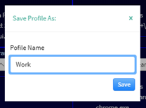
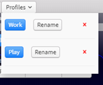

# Mult App Launcher

> Multi App Launcher

This is a small [electron](https://www.electronjs.org/) application that allows multiple applications to be launched simultaneously.  

### Usage 
Simple open the app, then choose as many programs as you would like.  
Increase the slider to get access to more program boxes.  
Once All your programs are selected (by clicking on the gear icon and navigating to either the program's shortcut, or its location),  
Simply click the 'Start All Programs' button to launch them all.  


Once you have all the programs you like, simple save your profile.  


You can have as many profiles as you like.  


### Theme
The dark and light theme are dependant on the Operating System theme.

### How it works
Each application is opened via `Electron.Shell.openItem`,   
Which should provide a platform agnostic way of launching each application.  
Profiles are saved in `%APPDATA%/<Your App>`.  

### Build Setup

``` bash
# install dependencies
npm install

# serve with hot reload at localhost:9080
npm run dev

# build electron application for production
npm run build

# lint all JS/Vue component files in `src/`
npm run lint

```

---

This project was generated with [electron-vue](https://github.com/SimulatedGREG/electron-vue)@[45a3e22](https://github.com/SimulatedGREG/electron-vue/tree/45a3e224e7bb8fc71909021ccfdcfec0f461f634) using [vue-cli](https://github.com/vuejs/vue-cli). Documentation about the original structure can be found [here](https://simulatedgreg.gitbooks.io/electron-vue/content/index.html).
