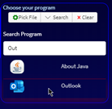

# Mult App Launcher

> Cross Platform Multi App Launcher

[](https://snapcraft.io/multi-app-launcher)

This is a small [electron](https://www.electronjs.org/) application that allows multiple applications to be launched simultaneously.  

## Install
Go to the [release page](https://github.com/Arges86/multi-app-launcher/releases) and download the latest version.  
The portable, or installable .exe file both are available.  
The installable instance will be a little faster running.  

For linux with snap:   
[](https://snapcraft.io/multi-app-launcher)

## Usage 
Simple open the app, then choose as many programs as you would like.  
Increase the slider to get access to more program boxes.  

There are three ways to add a program to the list:  
* Find the program or shortcut manually by clicking the gear icon.   
* Drag and drop the program, or link thereto into `Drag and Drop` field.   
* Or search for it with the search dropdown, and find the program on the list.   

   

Once All your programs are selected,  
Simply click the 'Start All Programs' button to launch them all.  


Once you have all the programs you like, simple save your profile.  


You can have as many profiles as you like.  


Lastly, can you add optional arguments to the startup command.  
For instance, to start Chrome in 'Incognito', click the gear icon and type `-incognito`  
into the options modal.  
Many programs have startup options that can be set. Two examples are:   
Firefox's list can be found [here](https://developer.mozilla.org/en-US/docs/Mozilla/Command_Line_Options).  
Chrome's list can be found [here](https://peter.sh/experiments/chromium-command-line-switches/).  

### Updates
The program checks for any updates at launch.   
If there are any updates available, a notification will appear on the icon in the top left.   
Click the icon, to open the about window with a download link.   


### Theme
The dark and light theme are dependant on the Operating System theme.

### How it works
Each application is opened via `Electron.Shell.openItem`,   
Which should provide a platform agnostic way of launching each application.  
Profiles are saved in `%APPDATA%/<Your App>`.  

Search looks in the default program list for the OS.  
For Windows: `C:\ProgramData\Microsoft\Windows\Start Menu\Programs`
For others: `/usr/share/applications`

Updates query Github for the newest release.  
if the semantic version at Github is greater than installed, a notification appears.  

### Build Setup

``` bash
# install dependencies
npm install

# serve with hot reload at localhost:9080
npm run dev

# build electron application for production
npm run build

# lint all JS/Vue component files in `src/`
npm run lint

```
The build step (for Windows) will create the installable and portable application for deployment.

---

This project was generated with [electron-vue](https://github.com/SimulatedGREG/electron-vue)@[45a3e22](https://github.com/SimulatedGREG/electron-vue/tree/45a3e224e7bb8fc71909021ccfdcfec0f461f634) using [vue-cli](https://github.com/vuejs/vue-cli). Documentation about the original structure can be found [here](https://simulatedgreg.gitbooks.io/electron-vue/content/index.html).
